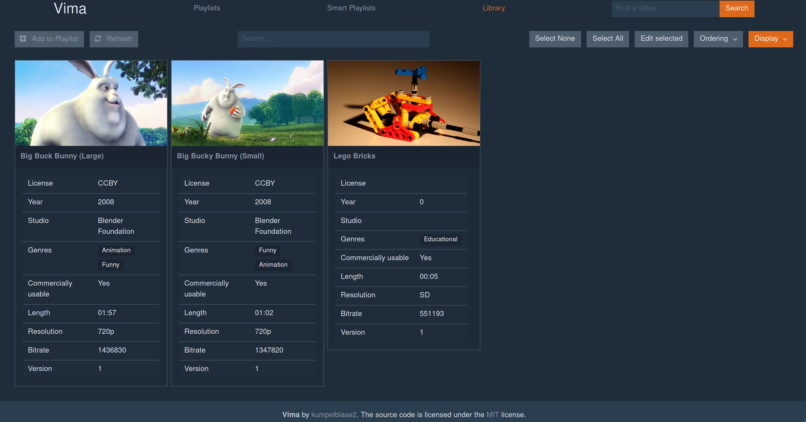

# Vima

**Vima** is a video manager or video collection. It manages a set of videos and allows the user to define custom metadata for each video. The user can then search for specific videos via the specified metadata using a custom query language, create playlists the same way and obviously play the videos in their browser.

This application takes a lot of inspiration from the Plex Media Server as the frustration with certain parts led to the creation of Vima.



(You can find more screenshots in the `screenshots` directory.)

Vima is licensed under the terms of the [MIT license](LICENSE). You can find the full license text in the license file in this repository.

## What is the problem with Plex / other media servers?

Plex is, for most people, a really good media server and serves their needs well. Because an average user mostly has a video collection at home that is primarily movies and tv shows. Plex is great for that because it automatically gets all the details for each movie from the web and there's nothing really to add.

The problem arises when you have a giant collection of videos that are not as neatly indexed and you want to search those _properly_. Plex' search used to be pretty horrible, only providing OR connections and being in general very limited, but Plex actually improved in this regard. However, it's still nowhere near the complexity I want since it's now a bunch of ANDs where you can only do an OR for each property, not freely combine ANDs and ORs.

Moreover, Plex is really lacking when it comes to customization of metadata. You can only use the already pre-defined fields from Plex(*) and combined with the lacking search, you can't really find the things you're actually looking for.

There are a couple more of personal annoyances with Plex, such as auto play pausing for 10 seconds if you haven't interacted for some time or not being able to regenerate thumbnails. I could live with these but I think this could be improved upon as well.

(*): There are also some stupid things with metadata in Plex. Some metadata will be pulled from the file metadata, but is not visible/editable in the UI (like Cast of a Movie). Others are there, but cannot be searched for (there's a 'Rating' when editing a video, but it's not the same field as 'Rating' in the search).

## Other Solutions

There are certainly other media servers available, but they pretty much just mirror Plex when it comes to functionality. They all manage a library of movies/shows which have a fixed metadata which they receive from some supplier (usually some agent pulling stuff from imbd or the like). As far as I can tell, I haven't found _any_ software that is freely available which allowed specifying custom metadata let alone searching on that. 

## My Solution

This project is my attempt to solve this dilemma. To, at some point, have a working solution, the scope of the project is very limited and will not come close to what Plex or other offer except for the mentioned pain points.

Vima's basic concept is that a video does not get any metadata from the system itself, but the user has to define everything that one could assign. The user can chose to let the system provide some metadata automatically by means of "metadata providers", but that has to be configured as well. All metadata fields can then be edited by the user to his liking and can be of different types. Such types include: Number range, Simple number, value list, text, boolean and tag list (and more). The query language helps to allow the user to find the exact video(s) he's searching for.

## Assumptions

These are assumptions that I made when developing this project. This is not to say that my goal is to specifically target these, but if there's a decision to be made, it'll be made with these assumptions in mind (e.g.: available Browser APIs).

- Modern Browser (e.g. FF 64 or Chrome 70)
    - Rationale: I'm using a modern browser which possible provides APIs that are not available on older ones. I don't think it's worth the
            time and effort to retrofit older browsers using polyfills or avoiding the newer APIs.
- Served locally or internal network (not internet)
    - Rationale: If videos are streamed over the internet, it's not a good idea to stream in the original quality because of bandwidth and connectivity. I don't want to re-encode videos on the fly just to allow this and make the application needlessly complex.
- Files are on a local drive (not network share)
    - Rationale: This isn't really something that I really enforce, the idea behind it is that I just want to assume that I can directly stream the video from the filestore. This doesn't necessarily mean no network storage, but it means that I'd like to avoid caching/prefetching videos because access to videos is slow.
- Desktop focus
    - Or otherwise: Desktop first. Rationale: The application will mostly be used on a computer with a horizontal screen attached to it. No vertical viewport but a large screen size. It should be _usable_ on mobile, but that should focus un watching the videos, not working with them.
- Single library
    - Rationale: I don't see the need to allow for multiple libraries, one could set up multiple instances of Vima to achieve the same.

They are specific to my use case, so you may disagree with some of them. If that's the case, feel free to submit a PR that adapts the current behavior to allow for different setups or just fork it.

## Setup

If you want to run Vima, you need the following:

- Ruby (and the bundler gem installed)
- MongoDB
- ffmpeg

Once these are installed, clone this repository to a place you like. After the cloning is finished, switch into the directory and install the dependencies using bundler:

```
$ bundle install --path vendor
```

After you go over the configuration, you can start Vima using `bin/rails s -e production`.

## Query Language

Vima uses a query language to properly search for videos. It is very similar to [Lucene's query language](http://www.lucenetutorial.com/lucene-query-syntax.html) but is less powerful. Just like Lucene, one can query for certain properties like `year:1980` and can combine queries using `AND` and `OR`, like `year:1980 OR year:1990`. This can be combined in any way and allows for brackets as well: `(year:1980 OR length>10) AND (year:1990 OR length<5)` allowing you to narrow down your search as much as you want. One thing that was consciously left out for example was the weighing of certain attributes as there's no intention of sorting videos that way.

The language features several operators for comparing values, checking their existence or negating things. See below for supported operations.

### Full text search

`text` type metadata is automatically indexed and allows for full text search. Thus a query like `hello world` would look for any text metadata in a video that contains either `hello` or `world`. You can use quotes to specifically match a string with multiple words. `"Hello World"` would look for the whole string `Hello World` in text.

### Exact match 
`metadata:value` check if the attribute `metadata` has value `value`. For all types, except taglists, this checks if the value is exactly the given value. For text with spaces, one has to use quotes, e.g. `notes:"Has a watermark"`.

For taglists, it checks if the given value is present in the lists of tags and allows for more than just that tag to be present.

### Relative Comparison
`metadata>value` and `metadata<value` check if `metadata` has a value that's bigger or smaller than `value` respectively.

### Negation / Absence
Using `-` one can check for the absence of any or a certain value, this can be seen as the opposite/negation of an exact match. `-license` would only match videos that don't have a license or `-license:MIT` would match all videos that don't have the MIT license.

### Existence / On
This checks effectively the opposite of a negation or absence. `+metadata` makes sure that a value exists for attribute `metadata`. There are special cases however: for taglists that means at least one value and for on/off values that means "on". So for example, `+license` would return any videos that have a license attached to them.

## Configuration

There are two main configuration files that you may want to adjust. First one being `config/mongoid.yml` which contains the information necessary to connect to the mongodb instance. Specifically, you would want to adjust the database name, host+port, user and password to your current configuration.

You also want to adjust `config/library.yml` as this is the main description of your library. It looks like this:

```yaml
production:
  dir: /path/to/videos # absolute location of videos
  defaults:
    order_by: name # Default Attribute to order by
    order_direction: asc # Default Ordering Direction
  home:
    videos: 12 # Amount of videos to show on landing page
  thumbnails:
    amount: 4 # Amount of thumbnails to generate
    dir: ".thumbnails" # relative directory for storing thumbnails
  playlist:
    display: # Which attributes should be displayed when watching videos in a playlist
     - bitrate
     - length
  metadata:
    # Custom Metadata that can be assigned to each video (see below)  
  providers:
    # Providers by the system that should be applied (see below)
```

### Metadata

Every metadata attribute consists of two or three things; the name, it's type and optionally any options. The names are usually all lowercase, and use an underscore (`_`) instead of a space, but will be converted automatically. So metadata with the name `contact_person` well be shown as `Contact Person`.

There are several kinds of metadata:
- `number` (Just a simple whole number)
- `on_off` (Checkbox for true/false)
- `text` (Plain text input)
- `range` (Range of numbers, e.g. 0-10)
- `select` (An element out of a selection of predefined values)
- `taglist` (A list of user-defined tags)
- `date` (A date)
- `duration` (A time duration)

You can define any number of these with any name, ordering or options you like. Not all types have options, the possible ones are listed below:

- `text` has `suggest` (boolean) -> suggests values from other values of this metadata
- `number` / `duration` / `range` have `min`, `max`, `step` (integers) -> the minimum, maximum value or size of steps between values.
- `select` has `values` (list) -> possible values one can select from

There are two ways of defining metadata. The short variant (without options) or the long variant (with options).
Short variant:

```yaml
production:
  # ...
  metadata:
    - notes: text
```

The above defines metadata of type `text` with the name `notes`. A text metadata attribute does not have any options so this works fine, but for a `select` it would look like this:

```yaml
production:
  # ...
  metadata:
    - name: license
      type: select
      options:
        values:
          - CC0
          - No license
          - CCBYSA
``` 

Which would create metadata of type `select` with the name `license` and allows for selecting one value from "CC0", "No license" or "CCBYSA". Please note that the first entry will be the default when editing a video.

#### Default Ordering

The application allows you to order videos when listing them. To make it less of a hassle to get the more common ordering for a certain metadata attribute, you may also define the default ordering direction. This can be done by specifying the `ordering` when defining the metadata:

```yaml
production:
  # ...
  metadata:
    - name: publish_year
      type: number
      ordering: desc
      options:
        # ...
``` 

### Metadata providers

Certain metadata can be provided by the system itself, if so desired. Such as the metadata stored inside the video itself, e.g. the length, bitrate, and resolution. However, metadata providers can also provide metadata that automatically adapts, such as a counting version, a pointing system, or watch counter. Usually these are read only as they are facts (such as bitrate), but not all of them are.

These are the currently existing metadata providers:

- `VideoVersion`
- `VideoMetadata`
- `WatchedStatus`
- `PointsProvider`

`VideoVersion` provides a `version` metadata attribute that gets counted up every time the video gets edited by the user.

`VideoMetadata` provides `length`, `resolution`, `bitrate` from the video using ffmpeg. `resolution` is one of "SD", "480p", "720p" or "1080p".

`WatchedStatus` adds metadata attributes relating to how often, when was the first and last time you watched a video and how far have you watched a video. These are `watched` (if the video has been watched), `watched_times` (the amount of times it has been watched), `last_watched` (the last time it has been watched), `first_watched` (the first time it has been watched), `added_date` (the day the video was added), and `last_watched_progress` (tracks the location you stopped watching and starts from there the next time you watch the video)

## Contributing

Feel free to contribute any kind of improvement, may that be wording, translation, UI/UX, new metadata provider, bug fixes or better documentation. This is a hobby project for me so time is a little limited and thus any help is appreciated. 

## Roadmap / Features for the future

There are obviously some things that I want to add to the application that I didn't work just yet. A couple of them are below.
These are mostly ideas that came to my mind that I thought would be a good idea, but I haven't fully flushed out yet or might not
even work as I would expect them to. If it's in the list below it does not mean that I _will_ add it, it's just something that I
would like to have.

- [ ] "Sorting mode": Some mode to easier set metadata on videos. For example, there will be three visible buckets: 1. Cartoon 2. Anime 3. Neither.
  It will go through each video in the library which does not have a value for this metadata and present it to you. You can then put it into either of the buckets.
- [ ] "Quick Actions": Configure certain actions to allow faster editing of certain metadata. For example, configuring a "watched" action, that allows you to quickly toggle/set the "watched" metadata value.
- [ ] Quick Edit for single videos
- [ ] Preview of videos when playing, like on youtube and other sites. So hovering over the timestamp will show a more or less accurate preview image
- [x] "Group Metadata": Basically a bundle of more metadata. For example: "studio.name", "studio.origin", "studio.established_in", ...
    - [ ] Allow lists of these objects
- [ ] Runtime editing of metadata
- [ ] Allowing metadata providers to define UI


## Internal TODO

- Improving video metadata display
- Allow for keeping video in fullscreen when switching to next one in playlist
